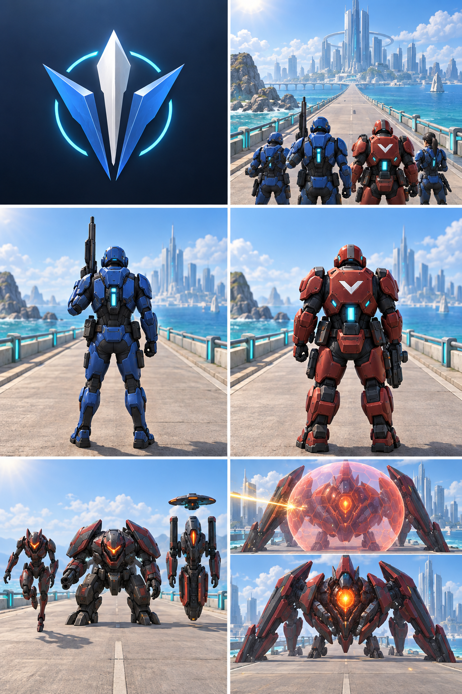

# P02-02 — Conceitos visuais da prova gráfica

Data: 16/09/2026
Status: concluído como estudo visual; não é asset de produção nem alteração de gameplay.

## Prancha aprovada para orientar a próxima prova

[Abrir prancha P02-02](P02-02-concept-board-2026-09-16.png)

O estudo reúne, em uma linguagem única de 3D estilizado premium: marca abstrata sem texto,
composição de intro em retrato, P1 azul visto por trás, P10 vermelho aliado, três silhuetas de
ameaça, cenário costeiro e dois estados visuais do boss. Ele segue o guia em
[`../VISUAL_DIRECTION.md`](../VISUAL_DIRECTION.md).

## Decisões confirmadas

- A estrada costeira, água turquesa, trilhos ciano, concreto claro e cidade no horizonte reforçam
  profundidade sem exigir excesso de partículas.
- P1 azul e P10 vermelho são aliados vistos por trás; o chevron branco e a contra-luz ciano do P10
  complementam a cor para reduzir confusão com inimigos quentes vistos de frente.
- Corredor estreito, blindado largo e suporte vertical foram separados por proporção e silhueta,
  não apenas por cor. São estudos para P05, sem novos inimigos implementados.
- O boss apresenta campo de escudo com impacto bloqueado e estado de núcleo exposto. São estudos
  de leitura para P05, sem escudo, vulnerabilidade ou dano novos no motor.

## Limites obrigatórios antes de produzir assets

- A proporção heroica do P10 nesta prancha é conceitual. No runtime ele preserva a representação
  P10 e a escala/âncora contratadas; não se copia volume, alcance ou poder visual como bônus de
  dano. A prova P02-04 deve respeitar `game/visuals.ts` e `game/squad-power.ts`.
- A prancha não demonstra corrida, muzzle, trajetória reta, colisão, portal em movimento, HUD,
  oclusão pelo dedo, FPS, memória ou temperatura. Esses aceites continuam em P02-04 a P02-06.
- A marca é uma exploração abstrata, sem nome ou tipografia final. P03 decide a aplicação em
  abertura/Home; nenhum logo é integrado ao aplicativo por esta atividade.
- A imagem é referência interna gerada para o projeto. Ela não substitui a verificação de origem e
  licença de assets finais descrita em `VISUAL_DIRECTION.md`.

## Evidência e validação executada

- Imagem criada em 16/09/2026 e preservada nesta pasta, sem sobrescrever assets existentes.
- Inspeção visual manual conferiu os seis grupos exigidos por P02-02: marca, intro, P1, P10,
  inimigos e cenário/boss.
- A revisão cruzada com `VISUAL_DIRECTION.md`, `docs/ASSET_PIPELINE.md`, `game/visuals.ts` e
  `game/squad-power.ts` confirmou os limites acima.
- Não foram executados testes de gameplay, renderização em aparelho ou medição de desempenho,
  pois esta atividade produz somente conceitos.
