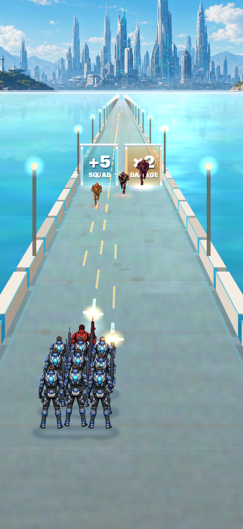

# P02-05 — Validação visual local da cena de referência

Data: 16/09/2026
Status: concluído no harness local; validação em aparelho permanece pendente em P02-06.

## Evidência

O quadro foi produzido pelo renderer e simulação reais no cenário
`27-p02-reference-power-019`: poder 19, um P10 vermelho e nove P1 azuis, três inimigos, portal,
estrada, horizonte, sombras e projéteis ativos. A inspeção visual manual confirmou que os inimigos
ficam antes do portal e que o P10 está no grupo aliado, com chevron branco adicional.

## Verificações executadas

- `tsc -p tsconfig.json --noEmit`: aprovado.
- Tiro/formação: **67/67** checks aprovados, incluindo `ROAD_FORWARD`, arrasto, colisão por faixa,
  muzzle no sprite, poder 19 e DPS equivalente.
- Fases/portal/persistência: **19/19** checks aprovados.
- Harness P02: captura após 2,4 s de simulação real. Inimigos ficam parados e imortais apenas para
  manter a leitura da imagem; `scripted` não grava progresso ou muda campanha.
- Abertura real: `20-earth-opening` avançou 6 s de campanha normal, com poder 1, dois inimigos,
  quatro projéteis ativos e 2 tiros/s; a cena em movimento compartilha o mesmo renderer da referência.

## Resultado local

| Requisito | Resultado |
| --- | --- |
| Perspectiva, chão, horizonte e sombras | Aprovado no quadro real |
| P10 distinto de inimigo | Aprovado por posição, vista traseira, halo e chevron; não por cor isolada |
| Muzzle e projéteis | Aprovado por checks e captura com projéteis reais |
| Ameaças, portal e sobreposição | Aprovado; inimigos reposicionados antes do portal |
| Movimento e colisão | Aprovado na simulação; sem avaliação tátil em aparelho |

## Limites

O harness não mede toque sob o dedo, GPU, memória, temperatura, carregamento ou compreensão por
jogadores. Esses itens pertencem a P02-06 e P13 e não são declarados aceitos aqui.
